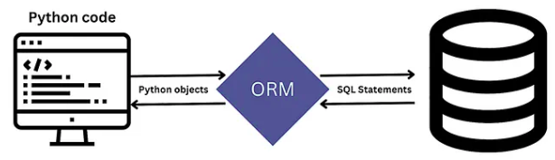
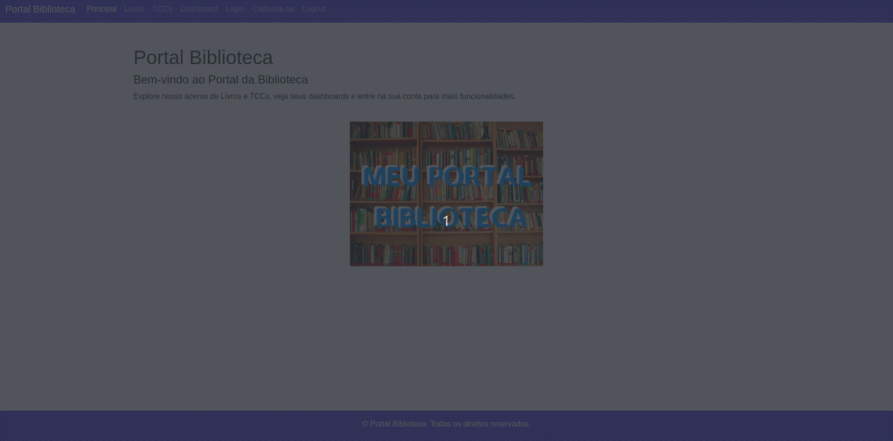
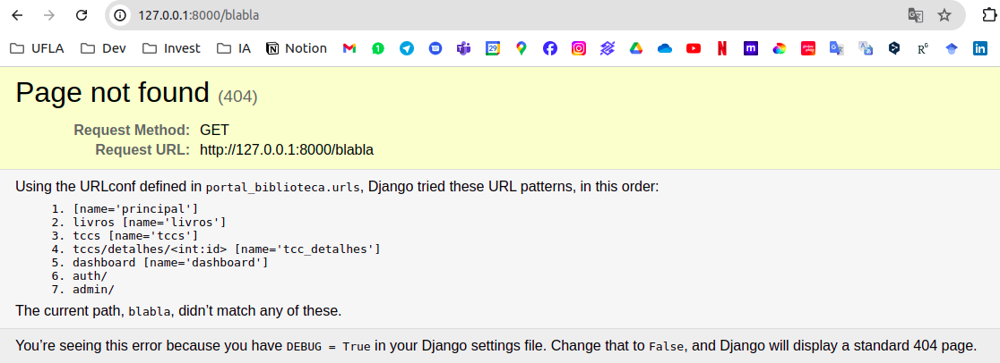
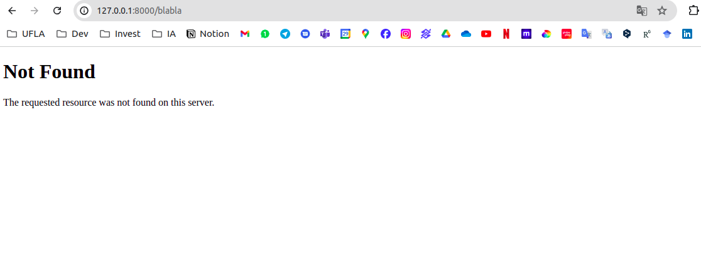
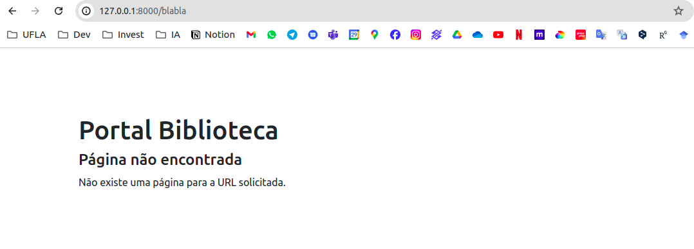
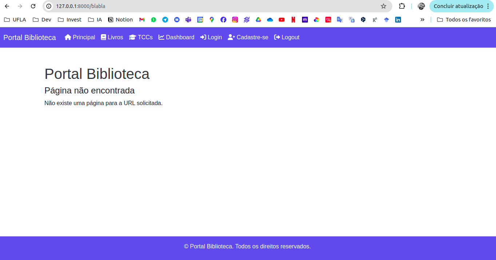

# Aula Django 03 - Sistema para Portal Biblioteca

<p align="center">
  <a href="#">
    
  </a>
  <a href="#">
    
  </a>
  <a href="#">
    
  </a>
</p>

## Índice

* [Introdução](#introdução)
* [Recursos Utilizados](#recursos-utilizados)
* [Fundamentos Teóricos](#fundamentos-teóricos)
* [Objetivo da Aula](#objetivo-da-aula)
* [Desenvolvimento do Projeto](#desenvolvimento-do-projeto)
* [Créditos e Referências](#créditos-e-referências)

## Introdução

<a href="#índice"></a>

O objetivo deste tutorial é criar um sistema para gestão de biblioteca usando o framework Python Django. Esse projeto será utilizado na disciplina GAC116 - Programação Web da Universidade Federal de Lavras (UFLA). Esta aula é uma continuação da Aula Django 02.

Este tutorial foi elaborado com base no tutorial disponível no [curso de Django da W3Schools](https://www.w3schools.com/django/index.php) e na [documentação oficial do Django](https://docs.djangoproject.com/pt-br/5.0/).

A aula está organizada no formato de tutorial, permitindo que cada estudante replique em seu computador os conceitos e recursos apresentados. O código será desenvolvido gradualmente, de modo a evidenciar a evolução da solução e facilitar a compreensão de como as tecnologias Django, HTML, CSS e JavaScript se integram na construção de aplicações web.

## Recursos Utilizados

<a href="#índice"></a>

A seguir estão listados os principais recursos empregados no desenvolvimento desta aula.

### Linguagens

* Python - Linguagem de programação principal
  * [Link do site Python](https://www.python.org/)
  * [Link do curso da W3Schools](https://www.w3schools.com/python/default.asp)
* HTML - Responsável pela estrutura da página web
  * [Link do curso da W3Schools](https://www.w3schools.com/html/default.asp)
* CSS - Responsável pela apresentação da página web
  * [Link do curso da W3Schools](https://www.w3schools.com/css/default.asp)
* JavaScript - Responsável pelo comportamento da página web
  * [Link do curso da W3Schools](https://www.w3schools.com/js/default.asp)
* SQL - Linguagem para consultas no banco de dados
  * [Link do curso da W3Schools](https://www.w3schools.com/sql/default.asp)

### Frameworks

* Django - Framework web
  * [Link do site do Django](https://www.djangoproject.com/)
  * [Link do curso da W3Schools](https://www.w3schools.com/django/index.php)
* Bootstrap - Framework CSS
  * [Link do site do Bootstrap](https://getbootstrap.com/)
  * [Link do curso da W3Schools](https://www.w3schools.com/bootstrap5/index.php)

### Bibliotecas

* Jinja - Biblioteca Python para templates
  * [Link do site do Jinja](https://jinja.palletsprojects.com/en/3.1.x/)
* Chart.js - Biblioteca JavaScript para gráficos
  * [Link do site do chart.js](https://www.chartjs.org/)
* FontAwesome - Biblioteca CSS para ícones
  * [Link do site do Fontawesome](https://fontawesome.com/)
  * [Link da documentação Fontawesome](https://docs.fontawesome.com/web/setup/get-started) 
  * [Link do curso da W3Schools](https://www.w3schools.com/icons/fontawesome5_intro.asp).
* WhiteNoise - Biblioteca Python para servir arquivos estáticos
  * [Link do site do Whitenoise](https://whitenoise.readthedocs.io/)

### Ferramentas

* Visual Studio Code - Ambiente de desenvolvimento integrado - [link](https://code.visualstudio.com/)
* Git - Sistema de controle de versão - [link](https://git-scm.com/)
* Github - Plataforma de hospedagem e colaboração em projetos de software - [link](https://github.com/)
* Pip - Gerenciador de pacotes do Python - [link](https://pypi.org/project/pip/)
* Venv - Ambiente virtual do Python - [link](https://docs.python.org/pt-br/3/library/venv.html)
* SQLite Online - SGBD - [link](https://sqliteonline.com/)
* DB Browser for SQLite - SGBD - [link](https://sqlitebrowser.org/)

## Fundamentos Teóricos

<a href="#índice"></a>

A seguir estão destacados alguns dos principais fundamentos teóricos para entendimento deste tutorial.

### Características do Django

**1. Framework completo:** Django oferece tudo o que é necessário para o desenvolvimento de uma aplicação web, incluindo roteamento de URLs, Mapeamento Objeto-Relacional (ORM), sistema de templates, autenticação, etc.

**2. Administração automática:** Com base nos modelos definidos, Django gera automaticamente uma interface administrativa poderosa e personalizável, economizando tempo no desenvolvimento de funcionalidades administrativas.

**3. ORM (*Object-Relational Mapping*):** O Django possui um ORM que facilita a interação com bancos de dados relacionais, permitindo que os desenvolvedores escrevam consultas em Python ao invés de SQL.

**4. Sistema de templates:** Django possui um sistema de templates eficiente que permite criar HTML dinâmico de forma organizada, utilizando lógica básica como laços e condicionais.

**5. Segurança embutida:** O Django se preocupa com a segurança, oferecendo proteção contra ataques comuns como SQL *Injection*, *Cross-site Scripting* (XSS), *Cross-site Request Forgery* (CSRF), e *Clickjacking*.

**6. Escalabilidade:** Django é altamente escalável, podendo lidar com grandes volumes de tráfego, como em sites populares que utilizam o framework (por exemplo, Instagram e Pinterest).

**7. Comunidade ativa e documentação:** Django conta com uma ampla comunidade de desenvolvedores e uma documentação completa e detalhada, facilitando a resolução de problemas e o aprendizado.

**8. Reutilização de código:** Django promove a reutilização de componentes por meio de pacotes chamados "apps". Cada app é modular e pode ser usado em diferentes projetos ou em diferentes partes da mesma aplicação.

**9. Suporte a várias bases de dados:** O Django suporta diferentes sistemas de banco de dados, como PostgreSQL, MySQL, SQLite e Oracle, tornando-o flexível para diversos ambientes.

**10. Testes integrados:** O Django tem suporte nativo para testes automatizados, permitindo que desenvolvedores escrevam e executem testes facilmente para garantir a qualidade do código.

### Arquitetura Web de Três Camadas

A arquitetura web de três camadas é um padrão de design de software que organiza uma aplicação em três níveis distintos, cada um com responsabilidades bem definidas. Essas camadas são:

**1. Camada de Apresentação (Frontend)**:

* Também chamada de interface de usuário, essa camada é responsável pela interação com o usuário. Ela inclui tudo o que o usuário vê e utiliza para interagir com o sistema, como páginas web, formulários, botões, e elementos visuais em geral.
* Aqui, são usados tecnologias como HTML, CSS, JavaScript e frameworks frontend (React, Angular, etc.).
* A camada de apresentação envia as entradas dos usuários para a camada de negócios e exibe os resultados de volta para o usuário.

**2. Camada de Negócios (Lógica da Aplicação - Backend)**:

* Nessa camada está a lógica de negócios da aplicação, ou seja, as regras que governam como os dados devem ser processados e as operações que devem ser realizadas. Ela trata os pedidos recebidos da camada de apresentação e executa as operações necessárias.
* Essa camada pode incluir validações, cálculos e chamadas ao banco de dados. Em termos de tecnologia, é geralmente desenvolvida com linguagens de programação como Python, Java, PHP, ou frameworks como Django, Spring Boot, Laravel, etc.

**3. Camada de Dados (Banco de Dados - Backend)**:

* A camada de dados gerencia o armazenamento e recuperação de dados em um banco de dados. Ela é responsável pela persistência dos dados e operações como criar, ler, atualizar e deletar (CRUD).
* Geralmente, são usados sistemas de gerenciamento de banco de dados relacionais (como MySQL, PostgreSQL) ou não relacionais (como MongoDB).
* A camada de negócios interage com essa camada para armazenar e buscar dados conforme necessário.

**Fluxo da Arquitetura de Três Camadas**:

* O usuário interage com a Camada de Apresentação.
* A Camada de Apresentação faz requisições para a Camada de Negócios.
* A Camada de Negócios processa a lógica e, se necessário, interage com a Camada de Dados.
* A Camada de Dados responde com os dados necessários para a Camada de Negócios.
* A Camada de Negócios retorna os resultados processados para a Camada de Apresentação.
* A Camada de Apresentação exibe os resultados para o usuário.

Essa separação facilita a manutenção e escalabilidade da aplicação, permitindo que cada camada possa ser modificada ou melhorada de forma independente.


### Arquitetura MVT do Django

O modelo MVT (*Model-View-Template*) é uma arquitetura usada no framework Django para desenvolvimento de aplicações web. Ele organiza a aplicação em três componentes principais:

* **Model (Modelo)**: Responsável pela definição da estrutura dos dados e a interação com o banco de dados. Ele define as classes que representam as tabelas e seus relacionamentos, além de métodos para realizar consultas e operações nos dados.

* **View (Visão)**: Contém a lógica da aplicação. A view recebe as requisições dos usuários, processa os dados (geralmente acessando o Model), e retorna uma resposta, como uma página HTML renderizada ou dados em formato JSON.

* **Template (Apresentação)**: É a camada de apresentação, onde o conteúdo dinâmico gerado pela View é inserido em arquivos HTML. Os templates permitem a separação da lógica de negócio da interface de usuário, tornando o código mais organizado.

Diferente do padrão MVC, onde o controller gerencia a lógica de controle, no Django, a função das views cumpre esse papel, enquanto os templates gerenciam a apresentação.

A figura abaixo detalha os componentes descritos acima.


No modelo MVT do Django, as requisições seguem um fluxo bem definido, onde cada componente (Model, View, Template) desempenha um papel específico no processamento e resposta de uma requisição HTTP. O fluxo funciona da seguinte forma:

* **Recebimento da Requisição (HTTP Request)**: Quando um usuário acessa uma URL no navegador, o Django recebe a requisição HTTP correspondente. Esse processo começa no URL *dispatcher* (mapeador de URLs), que verifica qual view deve ser chamada com base na URL requisitada.

* **View (Visão)**: A View é o ponto de entrada para o processamento da requisição. A função ou classe associada à URL recebida é executada. Ela é responsável por: Receber a requisição do usuário; Executar a lógica necessária, que pode incluir validações, processamento de dados, ou interações com o banco de dados através dos Models; e Retornar uma resposta apropriada.

* **Model (Modelo)**: Se a View precisar acessar ou manipular dados, ela fará isso por meio do Model. O Model contém a lógica de negócios relacionada à persistência de dados, permitindo a View realizar operações como criar, ler, atualizar ou deletar registros no banco de dados.

* **Template (Apresentação)**: Após processar os dados, a View geralmente prepara um contexto (um dicionário de dados) e passa esse contexto para o Template. O Template é um arquivo HTML com marcações especiais do Django que permitem a inserção de dados dinâmicos. O Template renderiza esses dados em uma estrutura HTML, exibindo o conteúdo adequado com base nas informações passadas pela View.

* **Resposta (HTTP Response)**: Depois que o Template é renderizado, a View retorna uma resposta HTTP (normalmente uma página HTML ou dados JSON em APIs) ao navegador ou cliente. Essa resposta contém o conteúdo processado e visualizado pelo usuário.

A figura abaixo detalha o fluxo descrito acima.


A figura abaixo detalha ainda mais a arquitetura MVT e as tecnologias envolvidas.


### Modelo ORM

O Django suporta o conceito de Mapeamento Objeto-Relacional (ORM). Através do ORM você define a modelagem de dados através de classes em Python. Com isso é possível gerar suas tabelas no banco de dados e manipulá-las sem necessidade de utilizar SQL (o que também é possível). Os registros de cada tabela são representados como instâncias das classes correspondentes. O ORM mapeia os objetos da aplicação para as tabelas do banco de dados, e vice-versa, facilitando o trabalho com dados de banco de dados em um ambiente de programação orientado a objetos.

Em um framework como Django, o ORM é uma parte fundamental. Ele permite que os desenvolvedores definam modelos de dados (classes Python) que representam as tabelas do banco de dados. Esses modelos incluem campos que representam as colunas do banco de dados e métodos que definem o comportamento dos objetos. O ORM traduz as operações realizadas nos objetos (como salvar, atualizar, excluir) em instruções SQL apropriadas para interagir com o banco de dados.

Usando o ORM, os desenvolvedores podem escrever código mais legível, portátil e seguro, pois não precisam lidar diretamente com SQL. Além disso, o ORM facilita a migração entre diferentes sistemas de gerenciamento de banco de dados (como PostgreSQL, MySQL, SQLite) sem a necessidade de alterações significativas no código da aplicação.



Fonte: [https://medium.com/@mochammadagusyahya](https://medium.com/@mochammadagusyahya/mastering-data-magic-unleashing-the-power-of-django-orm-in-your-web-development-journey-62fa851bf49a)

## Objetivo da Aula

<a href="#índice"></a>

O objetivo desta aula é dar continuidade à construção do projeto Portal da Biblioteca utilizando o framework Python Django. Aprenderemos a criar models, views e templates, além de cadastrar dados nos modelos definidos. As informações exibidas na interface agora serão carregadas diretamente do banco de dados, e não mais de dados fictícios definidos nas views. Também incluiremos no projeto o framework Bootstrap, para melhorar a visualização das páginas, e a biblioteca FontAwesome, para adicionar ícones. Por fim, veremos algumas configurações adicionais do Django, como, por exemplo, o tratamento da página de erro 404.

A animação abaixo mostra de forma visual o resultado esperado nesta aula.



## Desenvolvimento do Projeto

<a href="#índice"></a>

Siga os passos abaixo para alcançar o objetivo da aula.

### Clonar o Repositório

Para iniciar, faça o clone do repositório com o seguinte comando:

```bash
git clone https://github.com/ufla-prog-web/aula-django-03.git
```

### Abrir o Visual Studio Code

Abra o Visual Studio Code (VS Code) na pasta `aula-django-03`.

**Dica:** abra o arquivo `README.md` e selecione a opção `Open Preview to the Side` para visualizar o tutorial lado a lado enquanto desenvolve a aplicação.

**Dica:** abra um terminal utilizando a IDE clicando em `Terminal` e `New Terminal`.

### Navegar até a Pasta do Projeto

Navegue até a pasta do projeto (`code`) dentro da pasta baixada do Github (`aula-django-03`):

```bash
cd aula-django-03/
cd code/
```

### Criar o Ambiente Virtual

Crie um ambiente virtual para isolar as dependências do projeto:

```bash
python3 -m venv venv
```

**Observação:** no exemplo acima, o segundo nome `venv` é o nome que escolhemos para o nosso ambiente virtual (isso pode ser alterado).

### Ativar o Ambiente Virtual

Ative o ambiente virtual no seu computador utilizando o comando:

```bash
source venv/bin/activate
```

Para sair do ambiente virtual:

```bash
deactivate
```

### Fluxo de Trabalho no Django

A seguir, descreve-se um fluxo de trabalho que pode ser adotado durante o desenvolvimento de projetos com o framework Django.

[](https://mermaid.live/edit#pako:eNqN1E1y2yAUB_CrMHThTVLvveiMbcnfX9Nm0UTKgkrPDikCFZBTNxPfJaseoNMT-GJ9Qq5DNSyqlfjzAwF6wzPNVA60R7dCPWUPTFtyE6WS4NNPUjqVxjLBTj9Pv8GQFWRgzOlVc2ZSek-urz-QAaohBppstHoEq4hUJHpkcqeQNDMNnBxeZL8sA2roVJR0U9q3FRP8B9KOAWu53Jn35aGT0jQ948jhuIUL3Is40-5Zxk6Oaum-3n3zN1CUglkwb3rk9Dik-_pbxffKkNjY06vlmfLGjd24SWs9ew5PreVMHJyGPtCpdHvxU6dnrWlZXnDZOpCZk_P_O725w4sax98hq2xtMyUEZBZ_OO7N1wunl__qgn2Fgu80YiWNz5eOr1rcUfDdyrl14jNdSQN6D7pzKYu1YxtkfYnbMsg-gqmEZbmrtRXbww7ftRvRjNk0Bec3Ir8R-42R3xj7jYnfmNaTN8HnZP1F8x2zp1-aq3tyPB7JbdJdlxmeBRN_f95t3XGHecaM63Bbb_qMPQhAseVC9N6NooEfx-F4FI7H4XgSjqft2O-8u3RGfhyF41k4nofjRThehuOVH9MrWoAuGM_xonquWUrtAxSQ0h6-5rBlWA9YWvIFKaus-nSQGe1ZXcEVrcocKy_iDCuwoL0tEwZTyLlVetlcfu4OfPkDBV6NXw)

### Instalar o Django

Instale o Django dentro do ambiente virtual criado (testado na versão 5.0):

```bash
python3 -m pip install django
```

Verifique a versão instalada:

```bash
django-admin --version
```

ou

```bash
python3 -m django --version
```

**Observação:** caso o terminal não encontre o django-admin, execute o seguinte comando (utilizado geralmente quando não se utiliza o venv):

```bash
export PATH=$PATH:~/.local/bin
```

### Executar o Projeto

Antes de executar o projeto, aplique as migrações do banco de dados:

```bash
python3 manage.py migrate
```

Uma saída semelhante a esta deverá ser exibida:

```bash
Operations to perform:
  Apply all migrations: admin, auth, contenttypes, sessions
Running migrations:
  ...
```

Em seguida, execute o comando para copiar os arquivos estáticos:

```bash
python3 manage.py collectstatic
```

Uma saída semelhante a esta deverá ser exibida:

```bash
130 static files copied to '/media/jesimar/Workspace/Work3/1-Github/2-ufla-prog-web/aula-django-03/portal_biblioteca3/productionfiles'.
```

Inicie a execução do projeto Django:

```bash
python3 manage.py runserver
```

Acesse no navegador a página [http://127.0.0.1:8000/](http://127.0.0.1:8000/).

A aula anterior avançou até aqui.

### Criar o Primeiro Modelo

Até este momento, construímos nossa aplicação web com rotas, Template, Views, mas não trabalhamos com Banco de Dados (Modelos). Os dados estavam inseridos diretamente no código. Lembre-se de que o Django segue a aquitetura MVT (Model-View-Template). Agora, iremos abordar o M (Model), completando assim o ciclo da arquitetura.

Iremos criar o nosso modelo para representar Livros e TCCs no Banco de Dados SQLite disponível no Django. No Django, um modelo é uma classe Python que representa uma tabela no banco de dados. Esses modelos (classes) incluem atributos que representam as colunas da tabela e métodos que definem o comportamento dos objetos. O ORM traduz as operações realizadas nos objetos Python (como salvar, atualizar ou excluir) em instruções SQL apropriadas para o banco de dados.

Vamos criar uma classe para representar os livros. Para isso, abra o arquivo `biblioteca/models.py` e adicione o seguinte código:

```python
from django.db import models

class Livro(models.Model):       # classe adicionada
    nome = models.CharField(max_length=255)
    autor = models.CharField(max_length=255)
    ano = models.IntegerField()
```

Esse código cria uma tabela chamada Livro no BD SQLite. Os atributos `nome` e `autor` são campos de texto, limitados a 255 caracteres. O atributo `ano` é um campo numérico inteiro.

**Observação:** quando criamos o projeto, o Django gerou automaticamente um banco de dados SQLite vazio (`db.sqlite3`), localizado na raiz do diretório do projeto. Todos os modelos definidos serão armazenados como tabelas dentro desse arquivo.

Depois de definir o modelo, é necessário gerar os arquivos de migração, que descrevem como o banco de dados deve ser alterado. Execute o seguinte comando:

```bash
python3 manage.py makemigrations biblioteca
```

O que resultará nesta saída:

```bash
Migrations for 'biblioteca':
  biblioteca/migrations/0001_initial.py
    - Create model Livro
```

O Django cria um arquivo descrevendo as alterações e armazena o arquivo na pasta `/biblioteca/migrations/` com nome `0001_initial.py`. Abra esse arquivo para analisar o conteúdo. Observe que o Django sempre adiciona automaticamente um campo `id` como chave primária auto-incrementada.

A tabela ainda não foi criada, você terá que executar mais um comando, então o Django criará e executará uma instrução SQL, baseada no conteúdo do novo arquivo da pasta `/biblioteca/migrations/`. Para isso, aplique as migrações com o comando:

```bash
python3 manage.py migrate
```

Esse comando atualiza o esquema do banco de dados, criando a tabela Livro de acordo com o modelo definido.

O que resultará nesta saída:

```bash
Operations to perform:
  Apply all migrations: admin, auth, biblioteca, contenttypes, sessions
Running migrations:
  Applying biblioteca.0001_initial... OK
```

### Interagir com o Modelo Usando Linha de Comando

Nesta etapa, utilizaremos o interpretador Python (Python Shell) para interagir diretamente com o banco de dados e adicionar alguns registros (livros) à tabela criada.

Para abrir o shell, execute o comando:

```bash
python3 manage.py shell
```

O que resultará nesta saída:

```bash
Python 3.12.3 (main, Aug 14 2025, 17:47:21) [GCC 13.3.0] on linux
Type "help", "copyright", "credits" or "license" for more information.
(InteractiveConsole)
>>> 
```

No prompt `>>>`, importe o modelo Livro:

```bash
from biblioteca.models import Livro
```

Pressione `enter` e escreva o código abaixo para ver o conteúdo da tabela Livro:

```bash
Livro.objects.all()
```

Como a tabela está vazia, a saída será um QuerySet vazio:

```bash
<QuerySet []>
```

**Nota:** Um QuerySet é uma coleção de dados obtida do banco de dados.

Para adicionar um livro à tabela, execute:

```bash
livro = Livro(nome='O Senhor dos Anéis', autor='J.R.R. Tolkien', ano=1954)
livro.save()
```

Execute este comando para ver o conteúdo da tabela Livro:

```bash
Livro.objects.all().values()
```

O que resultará nesta saída:

```bash
<QuerySet [{'id': 1, 'nome': 'O Senhor dos Anéis', 'autor': 'J.R.R. Tolkien', 'ano': 1954}]>
```

Para sair do ambiente interativo, digite:

```bash
quit()
```

Você acaba de aprender como criar uma tabela no BD, como inserir registros nessa tabela e como visualizar os dados armazenados utilizando o interpretador do Python. Mais adiante, veremos outras formas de inserir e manipular informações no banco de dados.

### Acessar o Ambiente Administrativo

O Django Admin é uma das ferramentas mais poderosas do framework. Trata-se de uma interface gráfica CRUD (Create, Read, Update, Delete), que permite criar, visualizar, atualizar e excluir registros de todos os modelos do seu projeto de forma prática.

Para acessar a interface do painel administrativo, inicie o servidor de desenvolvimento com o comando:

```bash
python3 manage.py runserver
```

Acesse a URL: [http://127.0.0.1:8000/admin/](http://127.0.0.1:8000/admin/).

A razão pela qual esta URL vai para a página de login do administrador do Django pode ser encontrada no arquivo `portal_biblioteca/urls.py` do seu projeto:

```python
from django.contrib import admin
from django.urls import include, path

urlpatterns = [
    path('', include('biblioteca.urls')),
    path('admin/', admin.site.urls), # rota do ambiente administrativo
]
```

Na lista `urlpatterns[]`, a rota `admin/` é direcionada para `admin.site.urls`. Essa função faz parte de um aplicativo interno do Django, que já vem pronto para uso e disponibiliza diversas funcionalidades, entre elas a interface de login e gerenciamento administrativo.

### Criar um Usuário no Sistema

Para poder fazer login no ambiente administrativo do Django, precisamos criar um usuário. Isso é feito com o comando:

```bash
python3 manage.py createsuperuser
```

O que dará um prompt como esse:

```bash
Username: admin
Email address: 
Password: 
Password (again): 
The password is too similar to the username.
This password is too short. It must contain at least 8 characters.
This password is too common.
Bypass password validation and create user anyway? [y/N]: y
```

**Observação:** você deve inserir: nome de usuário, e-mail (opcional) e senha. Para testes, sugiro colocar: usuário `admin`, email em branco e senha `admin`. Caso a senha não atenda aos critérios, o Django oferece a opção de prosseguir mesmo assim digitando `y` gerando assim a saída:

```bash
Superuser created successfully.
```

Reinicie o servidor:

```bash
python3 manage.py runserver
```

Acesse: [http://127.0.0.1:8000/admin/](http://127.0.0.1:8000/admin/). Preencha o formulário com o nome de usuário e senha.

### Exibir os Modelos no Ambiente Administrativo

No ambiente administrativo aberto você pode Criar, Visualizar, Atualizar e Excluir grupos e usuários, mas onde está o modelo de Livro?

O modelo Livro está faltando, como deveria estar. Você tem que informar ao Django quais modelos devem estar visíveis na interface administrativa.

Para incluir o modelo Livro na interface administrativa, temos que dizer ao Django que este modelo deve estar visível na interface administrativa. Isso é feito em um arquivo chamado `admin.py` que está localizado na pasta do seu aplicativo.

Abra o arquivo `myapp/admin.py`:

```python
from django.contrib import admin

# Register your models here.
```

Insira as linhas abaixo para tornar o modelo Livro visível na página de administração:

```python
from django.contrib import admin
from .models import Livro

admin.site.register(Livro)
```

Acesse: [http://127.0.0.1:8000/admin/](http://127.0.0.1:8000/admin/) e analise o resultado.

### Melhorar Visualização do Modelo

Atualmente, o ambiente administrativo não está exibindo os dados dos modelos de forma adequada para o usuário. Veja isso, em Livros, em que temos "Livro object (1)", "Livro membro (2)" etc. O usuário geralmente não deseja ver os dados dessa forma. Seria melhor exibir "nome", "autor" e "ano".

Para mudar isso para um formato mais fácil de ler, temos duas opções:

* Alterar a função de representação de string `__str__()` do modelo de Livro.
* Definir a propriedade `list_details` do modelo de Livro.

Para alterar utilizando a primeira forma, devemos alterar a função de representação de string `__str__()` do modelo de Livro. Para isso, faça o seguinte no arquivo `biblioteca/models.py`:

```python
from django.db import models

class Livro(models.Model):
    nome = models.CharField(max_length=255)
    autor = models.CharField(max_length=255)
    ano = models.IntegerField()

    def __str__(self):           # função adionada
        return f"{self.nome} - {self.autor} - {self.ano}"
```

Acesse: [http://127.0.0.1:8000/admin/](http://127.0.0.1:8000/admin/) vá na tela de Livros e analise o resultado.

Para alterar utilizando a segunda forma (RECOMENDADA), devemos definir a propriedade `list_display` do arquivo `biblioteca/admin.py`. Primeiro, crie uma classe `LivroAdmin()` e especifique a tupla `list_display`, conforme abaixo:

```python
from django.contrib import admin
from .models import Livro

class LivroAdmin(admin.ModelAdmin):          # classe criada
    list_display = ("nome", "autor", "ano")

admin.site.register(Livro, LivroAdmin)       # classe adicionada
```

Acesse: [http://127.0.0.1:8000/admin/](http://127.0.0.1:8000/admin/) vá na tela de Livros e analise o resultado.

### Adicionar Novos Livros

Agora que temos o Django Admin configurado, já é possível criar, atualizar e excluir livros diretamente no banco de dados por meio da interface administrativa.

Para adicionar novos livros, clique no botão "ADD LIVRO", localizado no canto superior direito da tela.

Você será redirecionado para um formulário em branco, no qual poderá preencher as informações do livro.

**Dica:** Utilize as informações a seguir para preenchimento:

```json
{
    "nome": "1984",
    "autor": "George Orwell",
    "ano": 1949
},
{
    "nome": "Dom Quixote",
    "autor": "Miguel de Cervantes",
    "ano": 1605
}
```

Após preencher os campos de cada livro, clique em `SAVE` para salvar os dados no banco de dados. Os novos registros serão exibidos na listagem de livros, permitindo que você os visualize, edite ou exclua quando necessário.

### Carregar Dados de Livros do BD

Até agora, aprendemos a manipular o Banco de Dados no Django. No entanto, a interface da nossa aplicação para livros ainda não está conectada ao banco, ela exibe apenas dados inseridos manualmente no código.

Agora, vamos atualizar a interface para que os livros cadastrados no banco de dados sejam exibidos diretamente na página.

Edite o arquivo `biblioteca/views.py` e faça as seguintes alterações:

```python
...
from .models import Livro    # adicione esta importação

...

def livros(request):         # atualize esta função
    livros = Livro.objects.all().values()
    context = {
        'livros': livros
    }
    template = loader.get_template('livros.html')
    return HttpResponse(template.render(context, request))
```

**Observação:** agora os dados não estão mais fixos no código. Eles são carregados diretamente do banco de dados por meio do ORM do Django.

Acesse a URL: [http://127.0.0.1:8000/livros](http://127.0.0.1:8000/livros) e analise o resultado. Repare que os livros listados são somente os livros cadastrados no Banco de Dados.

### Criar o Modelo de TCC

Até este ponto, criamos apenas a tabela Livro no banco de dados. Agora, vamos adicionar uma nova tabela chamada TCC ao modelo do projeto.

Abra o arquivo `biblioteca/models.py` e adicione a classe TCC:

```python
...

class TCC(models.Model):    # classe adiconada
    titulo = models.CharField(max_length=255)
    autor = models.CharField(max_length=255)
    orientador = models.CharField(max_length=255)
    ano = models.IntegerField()

    def __str__(self):
        return f"{self.titulo} - {self.autor}"
```

Esse código cria uma tabela chamada TCC no banco de dados SQLite.

Para gerar a migração correspondente ao novo modelo, execute:

```bash
python3 manage.py makemigrations biblioteca
```

O que resultará nesta saída:

```bash
Migrations for 'biblioteca':
  biblioteca/migrations/0002_tcc.py
    - Create model TCC
```

A tabela ainda não foi criada, execute o comando de migração para que a tabela seja de fato criada:

```bash
python3 manage.py migrate
```

O que resultará nesta saída:

```bash
Operations to perform:
  Apply all migrations: admin, auth, biblioteca, contenttypes, sessions
Running migrations:
  Applying biblioteca.0002_tcc... OK
```


Para que o modelo TCC fique visível no Django Admin, precisamos registrá-lo. Assim, no arquivo `biblioteca/admin.py`, adicione o seguinte código:

```python
from django.contrib import admin
from .models import Livro
from .models import TCC    #linha adicionada

class LivroAdmin(admin.ModelAdmin):
    list_display = ("nome", "autor", "ano")

class TCCAdmin(admin.ModelAdmin):  # classe criada
    list_display = ("titulo", "autor", "orientador", "ano")

admin.site.register(Livro, LivroAdmin)
admin.site.register(TCC, TCCAdmin) # linha adicionada
```

Reinicie o servidor:

```bash
python3 manage.py runserver
```

Acesse a URL: [http://127.0.0.1:8000/admin/](http://127.0.0.1:8000/admin/). Agora, além do modelo Livro, você verá também o modelo TCC, pronto para ser gerenciado.

### Adicionar Novos TCCs

Agora, podemos criar, atualizar e excluir TCCs em nosso banco de dados.

Para adicionar novos TCCs, clique no botão "ADD TCC", localizado no canto superior direito da tela.

Você será redirecionado para um formulário em branco, no qual poderá preencher as informações do TCC.

**Dica:** utilize as informações a seguir para preenchimento:

```json
{
    "titulo": "Sistemas de Recomendação Personalizados",
    "autor": "Maria Silva",
    "orientador": "Prof. João Santos",
    "ano": 2021
},
{
    "titulo": "Segurança de Redes em Ambientes Corporativos",
    "autor": "Pedro Oliveira",
    "orientador": "Profa. Ana Rodrigues",
    "ano": 2020
},
{
    "titulo": "Inteligência Artificial Aplicada à Análise de Dados",
    "autor": "Luana Costa",
    "orientador": "Prof. André Martins",
    "ano": 2019
}
```

Preencha os campos e clique em `SAVE`.

### Carregar Dados de TCC do BD

Agora, vamos atualizar a interface para que os TCCs cadastrados no banco de dados sejam exibidos diretamente na página.

Edite o arquivo `biblioteca/views.py` e faça as seguintes alterações:

```python
...
from .models import TCC    # adicione esta importação

...

def tccs(request):         # atualize esta função
    tccs = TCC.objects.all().values()
    context = {
        'tccs': tccs,
    }
    template = loader.get_template('tccs.html')
    return HttpResponse(template.render(context, request))
```

Acesse a URL: [http://127.0.0.1:8000/tccs](http://127.0.0.1:8000/tccs) e analise o resultado. Repare que os TCCs listados são somente os cadastrados no Banco de Dados.

Edite o arquivo `biblioteca/views.py` e faça as seguintes alterações na função `tcc_detalhes` para que a mesma pegue os dados também do banco de dados baseado no `id`:

```python
...
def tcc_detalhes(request, id):   # atualize esta função
    tcc = TCC.objects.get(id=id)
    context = {
        'tcc': tcc,
    }
    template = loader.get_template('tcc_detalhes.html')
    return HttpResponse(template.render(context, request))
```

Acesse a URL: [http://127.0.0.1:8000/tccs](http://127.0.0.1:8000/tccs) e analise o resultado. Repare que os detalhes dos TCCs listados são somente os cadastrados no Banco de Dados.

Para mais informações, consulte a [documentação oficial do Django](https://docs.djangoproject.com/pt-br/5.0/topics/db/models/).

### Melhorar a Aparência com Bootstrap

Agora, iremos melhorar a aparência do nosso sistema utilizando o framework Bootstrap. Além de deixar a página mais bonita o Bootstrap a torna responsiva, se corretamente utilizado.

Para incorporar o Bootstrap no nosso projeto primeiro, atualize o arquivo `biblioteca/templates/base.html` conforme código abaixo:

```html

<!DOCTYPE html>
<html lang="pt-BR">
    <head>
        <meta charset="UTF-8">
        <meta name="viewport" content="width=device-width, initial-scale=1.0">
        <title></title>
        <link href="https://cdn.jsdelivr.net/npm/bootstrap@5.3.3/dist/css/bootstrap.min.css" rel="stylesheet">
        <link rel="stylesheet" href="">
    </head>
    <body>
        <header>
            <nav class="navbar navbar-expand-lg navbar-dark">
                <div class="container-fluid">
                    <a class="navbar-brand" href="/">Portal Biblioteca</a>
                    <button class="navbar-toggler" type="button" data-bs-toggle="collapse" data-bs-target="#navbarNav" aria-controls="navbarNav" aria-expanded="false" aria-label="Toggle navigation">
                        <span class="navbar-toggler-icon"></span>
                    </button>
                    <div class="collapse navbar-collapse" id="navbarNav">
                        <ul class="navbar-nav">
                            <li class="nav-item">
                                <a class="nav-link active" href="/">Principal</a>
                            </li>
                            <li class="nav-item">
                                <a class="nav-link active" href="/livros">Livros</a>
                            </li>
                            <li class="nav-item">
                                <a class="nav-link active" href="/tccs">TCCs</a>
                            </li>
                            <li class="nav-item">
                                <a class="nav-link active" href="/dashboard">Dashboard</a>
                            </li>
                            <li class="nav-item">
                                <a class="nav-link active" href="/auth/login">Login</a>
                            </li>
                            <li class="nav-item">
                                <a class="nav-link active" href="/auth/cadastro">Cadastre-se</a>
                            </li>
                            <li class="nav-item">
                                <a class="nav-link active" href="/auth/logout">Logout</a>
                            </li>
                            <li class="nav-item">
                                <a class="nav-link active" href="/admin">Admin</a>
                            </li>
                        </ul>
                    </div>
                </div>
            </nav>
        </header>

        
        

        <footer class="text-white text-center p-3 mt-5">
            <p>&copy; Portal Biblioteca. Todos os direitos reservados.</p>
        </footer>

        <script src="https://cdn.jsdelivr.net/npm/bootstrap@5.3.0/dist/js/bootstrap.bundle.min.js"></script>
    </body>
</html>
```

Comentários sobre as alterações relacionadas ao Bootstrap:

1. Linha de Importação do CSS do Bootstrap:

```html
<link href="https://cdn.jsdelivr.net/npm/bootstrap@5.3.3/dist/css/bootstrap.min.css" rel="stylesheet">
```

* Esta linha importa o CSS do Bootstrap da versão 5.3.3 via CDN, o que aplica automaticamente os estilos do Bootstrap em toda a página, possibilitando o uso de classes CSS prontas para layout e formatação.

2. Elementos com Classes do Bootstrap:

* `<nav class="navbar navbar-expand-lg navbar-dark">`:

    * `navbar`: Aplica o estilo básico de uma barra de navegação.
    * `navbar-expand-lg`: Faz a barra de navegação ser expansível (colapsável) em telas menores, exibindo todos os itens em telas grandes.
    * `navbar-dark`: Aplica cores para a navbar que são apropriadas para fundos escuros.

* `<div class="container-fluid">`:

    * `container-fluid`: Define um contêiner que ocupa toda a largura disponível, mantendo uma estrutura fluida e adaptável ao tamanho da tela.

* `<a class="navbar-brand" href="/">Portal Biblioteca</a>`:

    * `navbar-brand`: Aplica estilo a um elemento de marca (logo ou nome) na navbar, deixando-o em evidência.

* `<button class="navbar-toggler"`:
    
    * `navbar-toggler`: Define um botão de colapso para a navbar em telas pequenas.
    * `data-bs-toggle="collapse"` e `data-bs-target="#navbarNav"`: Atributos data usados pelo JavaScript do Bootstrap para controlar o comportamento de colapso.

* `<span class="navbar-toggler-icon"></span>`:

    * `navbar-toggler-icon`: Exibe o ícone de "hambúrguer", indicando que a navbar é expansível em dispositivos móveis.

* `<div class="collapse navbar-collapse" id="navbarNav">`:

    * `collapse`: Define que este conteúdo é colapsável.
    * `navbar-collapse`: Estilo específico para o colapso em uma barra de navegação.
    * `id="navbarNav"`: Identificador usado para associar o botão navbar-toggler a este conteúdo colapsável.

* `<ul class="navbar-nav">`:

    * `navbar-nav`: Aplica estilos para agrupar itens de navegação dentro da navbar.

* `<li class="nav-item">`:

    * `nav-item`: Aplica estilos a um item de navegação individual dentro da lista de navegação (`<ul>`).

* `<a class="nav-link active" href="/">`:

    * `nav-link`: Estilo padrão para um link de navegação dentro da navbar.
    * `active`: Estilo que destaca o link atualmente ativo.

* ``:

    * `rounded-pill`: Aplica um estilo de borda arredondada na imagem do avatar.

3. Footer com Classes do Bootstrap:

* `<footer class="text-white text-center p-3 mt-5">`

    * `text-white`: Define o texto em branco.
    * `text-center`: Centraliza o conteúdo do footer.
    * `p-3`: Aplica padding de 3 unidades em todas as direções.
    * `mt-5`: Aplica uma margem superior de 5 unidades, criando espaço entre o conteúdo acima e o footer.

4. Importação do JavaScript do Bootstrap:

```html
<script src="https://cdn.jsdelivr.net/npm/bootstrap@5.3.0/dist/js/bootstrap.bundle.min.js"></script>
```

* Essa linha importa o JavaScript do Bootstrap, essencial para os componentes interativos, como o botão de colapso da navbar e outros elementos interativos da interface.

Altere o código do arquivo `biblioteca/templates/principal.html` para o código abaixo:

```html





    Portal Biblioteca



    <main class="container mt-5">
        <h1>Portal Biblioteca</h1>
        <h4>Bem-vindo ao Portal da Biblioteca</h4>
        <p>Explore nosso acervo de Livros e TCCs, veja seus dashboards e entre na sua conta para mais funcionalidades.</p>
        <br>
        <center>
            
        </center>
    </main>

```

Altere o código do arquivo `biblioteca/templates/livros.html` para o código abaixo:

```html



    Portal Biblioteca - Livros



    <main class="container mt-5">
        <h1>Livros</h1>
        
            <div class="card">
                <div class="card-header card-title-obra">
                    <em>Livro:</em> {{ l.nome }}
                </div>
                <div class="card-body">
                    <p class="card-title"><em>Autor:</em> {{ l.autor }}</p>
                    <p class="card-title"><em>Ano:</em> {{ l.ano }}</p>
                </div>
            </div>
            <br>
        
        <br>
        <br>
        <br>
    </main>

```

Altere o código do arquivo `biblioteca/templates/tccs.html` para o código abaixo:

```html



    Portal Biblioteca - TCCs



    <main class="container mt-5">
        <h1>Trabalhos de Conclusão de Curso</h1>
        
            <div class="card">
                <div class="card-header card-title-obra">
                    <em>Título:</em> {{ tcc.titulo }}
                </div>
                <div class="card-body">
                    <p class="card-title"><em>Autor:</em> {{ tcc.autor }}</p>
                    <center><a href="tccs/detalhes/{{ tcc.id }}" class="btn btn-primary">Ver Detalhes</a></center>
                </div>
            </div>
            <br>
        
        <br>
        <br>
        <br>
    </main>

```

Altere o código do arquivo `biblioteca/templates/tcc_detalhes.html` para o código abaixo:

```html



    Portal Biblioteca - TCC - Detalhes



    <main class="container mt-5">
        <h1>Trabalho de Conclusão de Curso - Detalhes</h1>
        <div class="card">
            <div class="card-header card-title-obra">
                <em>Título:</em> {{ tcc.titulo }}
            </div>
            <div class="card-body">
                <p class="card-title"><em>Autor:</em> {{ tcc.autor }}</p>
                <p class="card-title"><em>Orientador:</em> {{ tcc.orientador }}</p>
                <p class="card-title"><em>Ano:</em> {{ tcc.ano }}</p>
            </div>
        </div>
        <br>
        <center><a href="/tccs" class="btn btn-primary">Voltar</a></center>
    </main>

```

Altere o código do arquivo `biblioteca/templates/dashboard.html` para o código abaixo:

```html





    Portal Biblioteca - Dashboard



    <main class="container mt-5">
        <h1>Dashboard</h1>
        <p>Visualize aqui os gráficos e informações de dados do Portal Biblioteca.</p>
        <div class="row">
            <div class="col-md-6">
                <div class="card">
                    <div class="card-body">
                        <h5 class="card-title">Dashboard 1</h5>
                        <p class="card-text">Informações sobre o número de obras por categoria em gráfico de barras.</p>                        
                        <div class="chart-container" style="position: relative; height:40vh;">
                            <canvas id="graficoNumVolumes"></canvas>
                        </div>
                    </div>
                </div>
            </div>
            <div class="col-md-6">
                <div class="card">
                    <div class="card-body">
                        <h5 class="card-title">Dashboard 2</h5>
                        <p class="card-text">Informações sobre o número de obras por categoria em gráfico de pizza.</p>
                        <div class="chart-container" style="position: relative; height:40vh;">
                            <canvas id="graficoPizza"></canvas>
                        </div>
                        
                    </div>
                </div>
            </div>
        </div>
    </main>

    <script src="https://cdn.jsdelivr.net/npm/chart.js"></script>
    <script src=""></script>

```

Altere o código do arquivo `staticfiles/mystyles.css` para o código abaixo:

```css
body {
  font-family: Arial, sans-serif;
}

h1 {
  color: #343a40;
}

header {
  background-color: #4D70EF;
}

footer {
  position: fixed;
  bottom: 0;
  width: 100%;
  background-color: #4D70EF;
}

.card:hover {
  transform: scale(1.02);
}

.card-title-obra {
  background-color: #375BDC;
  color: white;
}
```

Execute o seguinte comando para coletar os arquivos estáticos:

```bash
python3 manage.py collectstatic
```

Reinicie o servidor:

```bash
python3 manage.py runserver
```

Acesse a URL: [http://127.0.0.1:8000](http://127.0.0.1:8000) e análise a nova interface do sistema.

**Observação**: caso a página não seja exibida corretamente tente apagar o histórico de navegação para limpar a cache ou então entrar em uma guia anônima.

### Melhorar a Aparência com FontAwesome

Agora, iremos melhorar a aparência do nosso sistema utilizando os ícones da biblioteca CSS [FontAwesome](https://fontawesome.com/).

Para incorporar o FontAwesome no nosso sistema primeiro, atualize o arquivo `biblioteca/templates/base.html` conforme código abaixo:

```html

<!DOCTYPE html>
<html lang="pt-BR">
    <head>
        <meta charset="UTF-8">
        <meta name="viewport" content="width=device-width, initial-scale=1.0">
        <title></title>
        <link href="https://cdn.jsdelivr.net/npm/bootstrap@5.3.3/dist/css/bootstrap.min.css" rel="stylesheet">
        <link rel="stylesheet" href="https://cdnjs.cloudflare.com/ajax/libs/font-awesome/6.0.0-beta3/css/all.min.css">
        <link rel="stylesheet" href="">
    </head>
    <body>
        <header>            
            <nav class="navbar navbar-expand-lg navbar-dark">
                <div class="container-fluid">
                    <a class="navbar-brand" href="/">Portal Biblioteca</a>
                    <button class="navbar-toggler" type="button" data-bs-toggle="collapse" data-bs-target="#navbarNav" aria-controls="navbarNav" aria-expanded="false" aria-label="Toggle navigation">
                        <span class="navbar-toggler-icon"></span>
                    </button>
                    <div class="collapse navbar-collapse" id="navbarNav">
                        <ul class="navbar-nav">
                            <li class="nav-item">
                                <a class="nav-link active" href="/"><i class="fas fa-home"></i> Principal</a>
                            </li>
                            <li class="nav-item">
                                <a class="nav-link active" href="/livros"><i class="fas fa-book"></i> Livros</a>
                            </li>
                            <li class="nav-item">
                                <a class="nav-link active" href="/tccs"><i class="fas fa-graduation-cap"></i> TCCs</a>
                            </li>
                            <li class="nav-item">
                                <a class="nav-link active" href="/dashboard"><i class="fas fa-chart-line"></i> Dashboard</a>
                            </li>
                            <li class="nav-item">
                                <a class="nav-link active" href="/auth/login"><i class="fas fa-sign-in-alt"></i> Login</a>
                            </li>
                            <li class="nav-item">
                                <a class="nav-link active" href="/auth/cadastro"><i class="fas fa-user-plus"></i> Cadastre-se</a>
                            </li>
                            <li class="nav-item">
                                <a class="nav-link active" href="/auth/logout"><i class="fas fa-sign-out-alt"></i> Logout</a>
                            </li>
                            <li class="nav-item">
                                <a class="nav-link active" href="/admin"><i class="fa-solid fa-lock"></i> Admin</a>
                            </li>
                        </ul>
                    </div>                    
                </div>
            </nav>
        </header>

        
        

        <footer class="text-white text-center p-3 mt-5">
            <p>&copy; Portal Biblioteca. Todos os direitos reservados.</p>
        </footer>

        <script src="https://cdn.jsdelivr.net/npm/bootstrap@5.3.0/dist/js/bootstrap.bundle.min.js"></script>
    </body>
</html>
```

A seguir temos algumas explicações sobre as alterações no código HTML:

* `<link rel="stylesheet" href="https://cdnjs.cloudflare.com/ajax/libs/font-awesome/6.0.0-beta3/css/all.min.css">`: Adiciona o link para a CDN pública do Font Awesome, na versão 6.0.0-beta3. Com essa linha no `<head>`, você poderá utilizar os ícones sem precisar baixar a biblioteca localmente ou criar um kit.
* `<i class="fas fa-home"></i>`: inclui o ícone de "casa" com a classe `fa-home`. A classe `fas` define que é um ícone sólido (FAS do inglês, "*Font Awesome Solid*").

**Observação:** recomendamos criar uma conta no Font Awesome e criar um kit no desenvolvimento da sua plataforma web, ou seja, não utilize a CDN pública sugerida em seu projeto final.

Reinicie o servidor:

```bash
python3 manage.py runserver
```

### Configurar o Projeto em Português

Repare que todo o ambiente administrativo do Django está em inglês, vamos agora, alterar isso para português.

Edite o arquivo `portal_biblioteca/settings.py` com a seguinte alteração:

```python
...
LANGUAGE_CODE = 'pt-BR'
...
```

Acesse a URL: [http://127.0.0.1:8000/admin/](http://127.0.0.1:8000/admin/) e analise o resultado.

### Personalizar o Modelo de Página 404

Quando o usuário tenta acessar uma página que não existe, o Django retorna automaticamente um erro 404 (*Not Found*). Por padrão, esse erro é exibido por meio de uma visualização interna do framework, mas podemos personalizar essa página para oferecer uma melhor experiência ao usuário.

Para verificar como o Django trata o erro, acesse uma URL inexistente no navegador, por exemplo:

Acesse a URL [http://127.0.0.1:8000/blabla](http://127.0.0.1:8000/blabla).

Será obtido o seguinte resultado:



Isso ocorreu, pois a variável `DEBUG` está definida como `True` nas suas configurações no arquivo `portal_biblioteca/settings.py`.

No entanto, a forma esperada de saída de erro, quando o sistema estiver em produção, é a exibida abaixo:



Para obter uma saída semelhante a segunda forma (correta), você deve definir a variável `DEBUG` como `False`. Assim, você será direcionado para o modelo Django 404 integrado. Isso é feito no arquivo `portal_biblioteca/settings.py`, onde você também deve especificar o nome do host (`ALLOWED_HOSTS`) de onde seu projeto é executado:

```python
...
# SECURITY WARNING: don't run with debug turned on in production!
DEBUG = False

ALLOWED_HOSTS = ['*']
...
```

**Importante**: Quando `DEBUG = False`, o Django exige que você especifique os hosts nos quais permitirá que este projeto Django seja executado.

Quando o sistema estiver em produção, isso deve ser substituído por um nome de domínio adequado, semelhante abaixo:

```python
ALLOWED_HOSTS = ['yourdomain.com']
```

Mas, como ainda estamos em desenvolvimento, então podemos colocar qualquer domínio como abaixo:

```python
ALLOWED_HOSTS = ['*']
```

Escolhemos `*`, o que significa que qualquer endereço tem permissão para hospedar este site. Isso deve ser alterado para um nome de domínio real quando você implantar seu projeto em um servidor público.

O Django procurará um arquivo chamado `404.html` na pasta `biblioteca/templates` e o exibirá quando houver um erro 404. Se esse arquivo não existir, o Django mostrará o "*Not Found*" que você viu no exemplo acima.

Para personalizar esta mensagem, crie o arquivo `biblioteca/templates/404.html` com o seguinte conteúdo:

```html





    Portal Biblioteca - Erro 404



    <main class="container mt-5">
        <h1>Portal Biblioteca</h1>
        <h4>Página não encontrada</h4>
        <p>Não existe uma página para a URL solicitada.</p>
    </main>

```

Reinicie o servidor:

```bash
python3 manage.py runserver
```

Acesse a URL inexistente: [http://127.0.0.1:8000/blabla](http://127.0.0.1:8000/blabla) e você obterá o modelo 404 personalizado como abaixo:



No entanto, esse modelo deveria aparecer como abaixo. Precisaremos incluir uma biblioteca externa para que o Django consiga servir arquivos estáticos.



### Biblioteca para Servir Arquivos Estáticos

Devido a modificação anterior `DEBUG = False`, o Django passou a não mais servir arquivos estáticos, pelo menos não em produção. Para resolver isso, teremos que usar uma biblioteca de terceiros. Existem muitas alternativas, mostraremos como usar uma biblioteca Python chamada `WhiteNoise`.

Para instalar o WhiteNoise em seu ambiente virtual, digite o comando:

```bash
python3 -m pip install whitenoise
```

Para que o Django saiba que você deseja executar o WhitNoise, você precisa especificá-lo na lista `MIDDLEWARE` do arquivo `portal_biblioteca/settings.py`:

```python
...
MIDDLEWARE = [
    'django.middleware.security.SecurityMiddleware',
    'django.contrib.sessions.middleware.SessionMiddleware',
    'django.middleware.common.CommonMiddleware',
    'django.middleware.csrf.CsrfViewMiddleware',
    'django.contrib.auth.middleware.AuthenticationMiddleware',
    'django.contrib.messages.middleware.MessageMiddleware',
    'django.middleware.clickjacking.XFrameOptionsMiddleware',
    'whitenoise.middleware.WhiteNoiseMiddleware',               # linha adicionada
]
...
```

Há mais uma ação que você precisa executar antes de poder servir o arquivo estático. Você precisa coletar todos os arquivos estáticos utilizando o comando:

```bash
python3 manage.py collectstatic
```

EReinicie o servidor:

```bash
python3 manage.py runserver
```

Em modo de produção, o WhiteNoise será responsável por servir os arquivos estáticos automaticamente. Acesse um arquivo estático (por exemplo, [http://127.0.0.1:8000/static/mystyles.css](http://127.0.0.1:8000/static/mystyles.css)) para confirmar que o WhiteNoise está servindo o conteúdo corretamente.

Acesse uma URL inexistente: [http://127.0.0.1:8000/blabla](http://127.0.0.1:8000/blabla) e você obterá o modelo 404 personalizado como abaixo.


### Carregar Dados no Dashboard Através do BD

Agora, iremos atualizar o nosso código para que o dashboard exibido contenha gráficos com dados vindo do BD e não gráficos com dados fixados em código.
Para isso, precisamos fazer a seguinte atualização no arquivo `biblioteca/views.py`.

```python
...
def dashboard(request):
    context = {
        'labels': ['Livros', 'TCCs', 'Dissertações', 'Teses', 'Apostilas', 'Jornais'],
        'data': [12, 19, 8, 5, 2, 10]
    }
    template = loader.get_template('dashboard.html')
    return HttpResponse(template.render(context, request))
```

**Observação**: repare que os dados ainda estão fixos, mas agora é enviado para o template via Python (view).

Em seguida, precisamos atualizar o arquivo `biblioteca/templates/dashboard.html` conforme abaixo:

```html
...
    <script> <!-- Incluí esse script -->
        <!-- Cria variáveis globais para vindas do template para serem acessadas no JS externo "myscripts.js". -->
        const vlabels = {{ labels|safe }};
        const vdata = {{ data|safe }};
    </script>
    <script src="https://cdn.jsdelivr.net/npm/chart.js"></script>
    <script src=""></script>
...
```

**Explicação**: quando o JavaScript está em um arquivo separado, você não pode usar diretamente as tags de template do Django (`{{ }}`) dentro do arquivo. Uma solução é definir as variáveis no próprio HTML e, em seguida, acessá-las no arquivo JavaScript externo. No seu template HTML, defina as variáveis de dados (`vlabels` e `vdata`) dentro de um bloco `<script>` para que fiquem disponíveis globalmente. O `| safe` é um filtro do Django usado para garantir que os dados sejam renderizados sem qualquer escape adicional de HTML. Esse filtro é importante quando você está passando dados JSON ou arrays para JavaScript, pois ele impede que o Django faça a escapada automática (substituindo, por exemplo, `"` por `&quot;`). Sem o filtro `|safe`, o Django escaparia caracteres especiais nos dados, resultando em valores incorretos ou erro de sintaxe.

Atualize o arquivo `myscripts.js` conforme abaixo:

```javascript
function graficoBarras() {
    const ctx = document.getElementById('graficoNumVolumes');

    new Chart(ctx, {
        type: 'bar',
        data: {
        labels: vlabels, // Alterei aqui. Acessa variável global 'labels'
        datasets: [{
            label: 'Número de Volumes',
            data: vdata,  // Alterei aqui. Acessa a variável global 'data'
            borderWidth: 1
        }]
        },
        options: {
        scales: {
            y: {
                beginAtZero: true
            }
        }
        }
    });
}          

function graficoPizza(){
    const ctx = document.getElementById('graficoPizza');

    new Chart(ctx, {
        type: 'pie',
        data: {
        labels: vlabels, // Alterei aqui. Acessa variável global 'labels'
        datasets: [{
            label: 'Número de Volumes',
            data: vdata, // Alterei aqui. Acessa a variável global 'data'
            backgroundColor: [
                'rgb(255, 99, 132)',
                'rgb(54, 162, 235)',
                'rgb(255, 205, 86)',
                'rgb(80, 60, 200)',
                'rgb(255, 100, 86)',
                'rgb(54, 255, 150)'
            ],
            hoverOffset: 8
        }]
        }
    });
}

graficoBarras();

graficoPizza();
```

**Explicação**: no arquivo `myscripts.js`, você pode agora acessar as variáveis `vlabels` e `vdata` diretamente, pois elas foram definidas no escopo global do HTML.

Em seguida, execute comando abaixo para fazer a cópia dos arquivos estáticos alterados:

```bash
python3 manage.py collectstatic
```

Reinicie o servidor:

```bash
python3 manage.py runserver
```

Após essas alterações, os dados exibidos nos gráficos vêem da View e não do JavaScript, mas ainda continuam fixos. Experimente alterar os valores do quantitativo de livros no arquivo `biblioteca/views.py` e analise o resultado (atenção: pode ocorrer de ter que limpar o cache).

Nessa etapa, vamos pegar os dados das tabelas do BD.

No arquivo `biblioteca/views.py` inclua o seguinte código:

```python
...
def dashboard(request):
    qtdLivros = Livro.objects.count()
    qtdTCCs = TCC.objects.count()
    context = {
        'labels': ['Livros', 'TCCs'],
        'data': [qtdLivros, qtdTCCs]
    }
    template = loader.get_template('dashboard.html')
    return HttpResponse(template.render(context, request))
```

Reinicie o servidor:

```bash
python3 manage.py runserver
```

Avalie os gráficos mostrados. Inclua ou apague livros ou TCCs e veja a mudança refletida nos gráficos.

### Informações Adicionais sobre BD

Caso queira ver as instruções SQL que foram executadas na migração do BD, basta digitar o comando abaixo, com o número da migração:

```bash
python3 manage.py sqlmigrate biblioteca 0001
```

**Observação:** no comando acima `biblioteca` representa o nome da nossa aplicação web e o número 0001 é o número da migração.

O que resultará nesta saída:

```sql
BEGIN;
--
-- Create model Livro
--
CREATE TABLE "biblioteca_livro" ("id" integer NOT NULL PRIMARY KEY AUTOINCREMENT, "nome" varchar(255) NOT NULL, "autor" varchar(255) NOT NULL, "ano" integer NOT NULL);
COMMIT;
```

Para vermos com detalhes o conteúdo do BD, podemos utilizar a ferramenta [DB Browser for SQLite](https://sqlitebrowser.org/). Assim, basta abrir o arquivo do BD chamado `db.sqlite3` que está na raiz do projeto.

O software [DB Browser for SQLite](https://sqlitebrowser.org/) oferece uma forma simples e prática de visualizar dados, mas precisa de instalação adicional. Utilize essa ferramenta para abrir o arquivo do BD chamado `db.sqlite3`. Para ver os dados de uma tabela você pode ir na aba `Navegar dados` ou então `Executar SQL` e executar a SQL abaixo:

```sql
SELECT * FROM biblioteca_livro;
```

**Observação:** repare que o nome físico da tabela segue o padrão `<app>_<modelo>`, por exemplo `biblioteca_livro`.

## Créditos e Referências

<a href="#índice"></a>

Este tutorial foi inspirado nos seguintes materiais:

* [Documentação oficial do Django](https://docs.djangoproject.com/pt-br/5.0/)
* [Curso de Django da W3Schools](https://www.w3schools.com/django/index.php)
