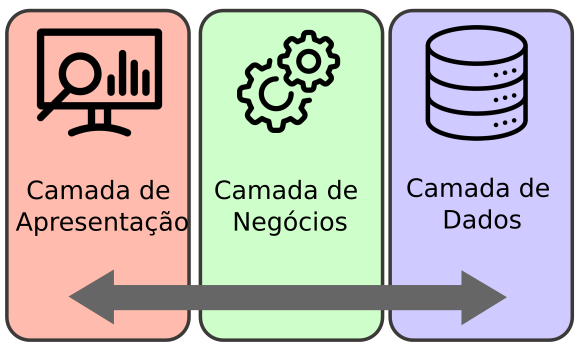

# Aula Djando 03 - Sistema para Portal Biblioteca

<p align="center">
  <a href="#">
    
  </a>
  <a href="#">
    
  </a>
  <a href="#">
    
  </a>
</p>

Aula Djando 03. Projeto utilizando o Django para ser desenvolvido na Aula de GAC116 - Programação Web.

O objetivo desse projeto é criar um sistema para gestão de biblioteca.

Este tutorial foi elaborado baseado no tutorial disponível no [curso de django da w3schools](https://www.w3schools.com/django/index.php) e também baseado na [documentação oficial do django](https://docs.djangoproject.com/en/4.2/).

## Linguagens Utilizadas

* Python - [link](https://www.python.org/)
* JavaScript - [link](https://www.javascript.com/)
* HTML - [link](https://html.com/)
* CSS - [link](https://www.w3schools.com/css/)

## Framework Utilizados

* Django - [link](https://www.djangoproject.com/)
* Bootstrap - [link](https://getbootstrap.com/)
* Chart.js - [link](https://www.chartjs.org/)

## Ferramentas Utilizadas

* Pip - [link](https://pypi.org/project/pip/)
* VirtualEnv - [link](https://virtualenv.pypa.io/)
* Visual Studio Code - [link](https://code.visualstudio.com/)
* SQLite Online - [link](https://sqliteonline.com/)
* DB Browser for SQLite - [link](https://sqlitebrowser.org/)

## Arquitetura Web

### Arquitetura Geral das Aplicação Web



Fonte: [https://blog.grancursosonline.com.br/arquitetura-em-tres-camadas-para-aplicacoes-web/](https://blog.grancursosonline.com.br/arquitetura-em-tres-camadas-para-aplicacoes-web/)

## Arquitetura Django

### Arquitetura MVT - Geral


### Arquitetura MVT - Requisição


### Arquitetura MVT - Detalhes


## Objetivo da Aula

A animação abaixo mostra de forma visual o resultado esperado nesta aula.


## Comandos utilizados na criação deste projeto

### Clonando o Repositório

Inicialmente, clone o repositório da seguinte forma:

```bash
git clone https://github.com/ufla-prog-web/aula-django-03.git
```

### Baixando o Repositório

Caso deseje ao invês de clonar o repositório (método acima), baixe o repositório do [link](https://github.com/ufla-prog-web/aula-django-03) clicando em `Code` e `Download ZIP`.

### Instalação do VirtualEnv

Se necessário, instale o virtualenv (testado na versão 20.24.1):

```bash
pip3 install virtualenv
```

ou

```bash
python3 -m pip install --user virtualenv
```

Verifique a versão instalada do virtualenv (para ter certeza que tudo ocorreu bem):

```bash
virtualenv --version
```

ou

```bash
python3 -m virtualenv --version
```

### Criação do Ambiente Virtual

Navegue até a pasta `aula-djando-03/portal_biblioteca`.

Crie o ambiente virtual para isolar as instalações Python:

```bash
python3 -m virtualenv venv
```

ou

```bash
virtualenv venv
```

Ativei o ambiente virtual para fazer as instalações de forma isolada:

**Sistema Operacional:** Unix/Mac OS:

```bash
source venv/bin/activate
```

**Sistema Operacional:** Windows

```bash
venv\Scripts\activate.bat
```

Quando desejar sair do ambiente virtual, basta digitar:

```bash
(venv) ... $ deactivate
```

### Instalação do Django

Instale o django dentro do ambiente virtual criado (testado na versão 4.2.5):

```bash
(venv) ... $ pip3 install django
```

ou

```bash
(venv) ... $ python -m pip install Django
```

Verifique a versão instalada do django (para ter certeza que tudo ocorreu bem):

```bash
(venv) ... $ django-admin --version
```

ou

```bash
(venv) ... $ python3 -m django --version
```

**OBS:** Caso o terminal não encontre o django-admin, execute o seguinte comando abaixo (utilizado geralmente quando não se utiliza o VirtualEnv no laboratório DCC07):

```bash
export PATH=$PATH:~/.local/bin
```

### Abrindo o Visual Studio Code

Abra a IDE Visual Studio Code na pasta aula-django-03.

**Dica:** Abra o arquivo `README.md` e clique em `Open Preview to the Side` para facilitar a construção da aplicação.

**Dica:** Abra um terminal utilizando a IDE clicando em `Terminal` e `New Terminal`. Navegue até a pasta `portal_biblioteca`.

### Executando o Projeto

Inicie a execução do projeto django criado:

```bash
(venv) ... $ python3 manage.py runserver
```

**OBS:** Por padrão, o servidor de desenvolvimento escuta na porta 8000, mas você pode especificar uma porta diferente como argumento opcional, por exemplo, `python3 manage.py runserver 8081`.

Acesse através do navegdor web a página [http://127.0.0.1:8000/](http://127.0.0.1:8000/). Uma página padrão do django deve aparecer.

### Criando nosso Primeiro Modelo

Até esse momento fizemos a nossa aplicação web com interface, com URLs e algum processamento, mas não trabalhamos com Banco de Dados. Os dados estavam inseridos diretamente no código.

Iremos agora criar o nosso modelo para representar Livros e TCCs no Banco de Dados SQLite disponível no Django. No Django, os dados são criados em objetos, chamados Modelos, e na verdade são tabelas em um banco de dados.

Primeiramente, iremos criar uma classe chamada `Livro`. Para isso abra o arquivo `models.py` na pasta `biblioteca` e digite o seguinte conteúdo:

```python
from django.db import models

class Livro(models.Model):
    nome = models.CharField(max_length=255)
    autor = models.CharField(max_length=255)
    ano = models.IntegerField()
```

O código acima irá criar uma Tabela chamada Livro no BD SQLite. Os campos `nome` e `autor` são campos de texto e estão configurados para ter no máximo 255 caracteres. O campo `ano` é um campo numérico inteiro.

OBS: Quando criamos o projeto Django, obtivemos um banco de dados SQLite vazio. Ele estava na raiz da pasta portal_biblioteca e possui o nome de arquivo db.sqlite3. Por padrão, todos os modelos criados no projeto Django serão criados como tabelas neste banco de dados.

Em seguida, execute o código abaixo para que seja criado a tabela Livro no banco de dados de fato:

```bash
(venv) ... $ python3 manage.py makemigrations biblioteca
```

**OBS:** Após definir os modelos, você cria migrações com este comando. Isso cria arquivos de migração que descrevem como o banco de dados deve ser modificado para refletir as alterações nos modelos.

O que resultará nesta saída:

```bash
Migrations for 'biblioteca':
  biblioteca/migrations/0001_initial.py
    - Create model Livro
```

O Django cria um arquivo descrevendo as alterações e armazena o arquivo na pasta `/biblioteca/migrations/` com nome `0001_initial.py`. Abra esse arquivo para analisar o conteúdo. Observe que o Django insere um campo `id` para suas tabelas, que é um número auto incrementado.

A tabela ainda não foi criada, você terá que executar mais um comando, então o Django criará e executará uma instrução SQL, baseada no conteúdo do novo arquivo da pasta `/biblioteca/migrations/`.

Execute o comando de migração:

```bash
(venv) ... $ python3 manage.py migrate
```

**OBS:** Este comando aplica as migrações, ou seja, atualiza o esquema do banco de dados de acordo com as mudanças nos modelos.

O que resultará nesta saída:

```bash
Operations to perform:
  Apply all migrations: admin, auth, biblioteca, contenttypes, sessions
Running migrations:
  Applying biblioteca.0001_initial... OK
```

Usaremos o interpretador Python (Python Shell) para adicionar alguns livros a tabela criada no BD. Para abrir um shell Python, digite este comando:

```bash
(venv) ... $ python3 manage.py shell
```

O que resultará nesta saída:

```bash
Python 3.10.12 (main, Jun 11 2023, 05:26:28) [GCC 11.4.0] on linux
Type "help", "copyright", "credits" or "license" for more information.
(InteractiveConsole)
>>>
```

Na parte inferior, após os três, `>>>` escreva o seguinte:

```bash
>>> from biblioteca.models import Livro
```

Pressione [enter] e escreva isto para ver a tabela Livro vazia:

```bash
>>> Livro.objects.all()
```

Isso deve fornecer um objeto QuerySet vazio, como este:

```bash
<QuerySet []>
```

Um QuerySet é uma coleção de dados de um banco de dados.

Adicione um registro à tabela, executando estas duas linhas:

```bash
>>> livro = Livro(nome='O Senhor dos Anéis', autor='J.R.R. Tolkien', ano=1954)
>>> livro.save()
```

Execute este comando para ver se a tabela Livro possui um membro:

```bash
Livro.objects.all().values()
```

O que resultará nesta saída:

```bash
<QuerySet [{'id': 1, 'nome': 'O Senhor dos Anéis', 'autor': 'J.R.R. Tolkien', 'ano': 1954}]>
```

Para sair do ambiente shell digite:

```bash
quit()
```

### Ambiente Administrativo do Django

O Django Admin é uma ferramenta ótima do Django, na verdade é uma interface de usuário CRUD (Criar, Ler, Atualizar, Excluir) para todos os seus modelos!

Para entrar na interface do usuário administrativo, inicie o servidor com este comando:

```bash
(venv) ... $ python3 manage.py runserver
```

Na janela do navegador, digite na barra de endereço [127.0.0.1:8000/admin/](127.0.0.1:8000/admin/)

A razão pela qual esta URL vai para a página de login do administrador do Django pode ser encontrada no arquivo `urls.py` do seu projeto:

```python
from django.contrib import admin
from django.urls import include, path

urlpatterns = [
    path('', include('biblioteca.urls')),
    path('admin/', admin.site.urls),
]
```

A lista `urlpatterns[]` recebe solicitações na rota `admin/` e as envia para `admin.site.urls`, que faz parte de um aplicativo integrado que vem com o Django e contém muitas funcionalidades e interfaces de usuário, sendo uma delas a interface de usuário de login.

### Criando um Usuário no Django

Para poder fazer login no ambiente administrativo do Django, precisamos criar um usuário. Isso é feito digitando este comando:

```bash
(venv) ... $ python3 manage.py createsuperuser
```

O que dará um prompt como esse:

```bash
Username: admin
Email address: 
Password: 
Password (again): 
The password is too similar to the username.
This password is too short. It must contain at least 8 characters.
This password is too common.
Bypass password validation and create user anyway? [y/N]: y
```

**OBS:** Aqui você deve inserir: nome de usuário, endereço de e-mail (você pode simplesmente deixar em branco ou escolher um endereço de e-mail falso) e senha. Em meu caso coloquei usuário `admin` email em branco e senha `admin`.

Minha senha não atendeu aos critérios, mas este é um ambiente de teste, e opto por criar usuário mesmo assim, digitando `y` gerando assim a saída:

```bash
Superuser created successfully.
```

Agora reinicie o servidor:

```bash
(venv) ... $ python3 manage.py runserver
```

Na janela do navegador, digite na barra de endereço [127.0.0.1:8000/admin/](127.0.0.1:8000/admin/)

Preencha o formulário com o nome de usuário e senha corretos (`admin` e `admin`):

Na tela aberta você pode criar, ler, atualizar e excluir grupos e usuários, mas onde está o modelo de Livro?

O modelo Livro está faltando, como deveria estar. Você tem que informar ao Django quais modelos devem estar visíveis na interface administrativa.

Para incluir o modelo Livro na interface administrativa, temos que dizer ao Django que este modelo deve estar visível na interface administrativa.

Isso é feito em um arquivo chamado `admin.py`, e está localizado na pasta do seu aplicativo, que no nosso caso é a pasta `biblioteca`.

Abra-o, o mesmo deve estar assim:

```python
from django.contrib import admin

# Register your models here.
```

Insira algumas linhas aqui para tornar o modelo Livro visível na página de administração:

```python
from django.contrib import admin
from .models import Livro

admin.site.register(Livro)
```

Agora volte para o navegador e atualize a barra de endereço [127.0.0.1:8000/admin/](127.0.0.1:8000/admin/)

Clique em Livros e veja o registro de livros que inserimos anteriormente neste tutorial:

Na lista de Livros, vemos "Livro object (1)", "Livro membro (2)" etc., que podem não ser os dados que você deseja que sejam exibidos na lista. Seria melhor exibir "nome" e "autor".

Para mudar isso para um formato mais fácil de ler, temos duas opções:

* Alterar a função de representação de string `__str__()` do modelo de Livro.
* Defina a propriedade `list_details` do modelo de Livro.

Para alterar utilizando a primeira forma, devemos alterar a função de representação de string `__str__()` do modelo de Livro. Para isso faça o seguinte no arquivo `models.py` dentro da pasta `biblioteca`:

```python
from django.db import models

class Livro(models.Model):
    nome = models.CharField(max_length=255)
    autor = models.CharField(max_length=255)
    ano = models.IntegerField()

    def __str__(self):  #definição de função adionada
        return f"{self.nome} - {self.autor}" 
```

Agora volte para o navegador e atualize a barra de endereço [127.0.0.1:8000/admin/](127.0.0.1:8000/admin/)

Para alterar utilizando a segunda forma (RECOMENDADA), devemos definir a propriedade `list_display` do arquivo `admin.py`. Primeiro crie uma classe `LivroAdmin()` e especifique a tupla `list_display`, assim:

```python
from django.contrib import admin
from .models import Livro

class LivroAdmin(admin.ModelAdmin):
    list_display = ("nome", "autor", "ano")

admin.site.register(Livro, LivroAdmin)
```

*OBS:* Lembre-se de adicionar LivroAdmin como um argumento no arquivo, como em: `admin.site.register(Livro, LivroAdmin)`.

Agora volte para o navegador e atualize a barra de endereço [127.0.0.1:8000/admin/](127.0.0.1:8000/admin/)

### Adicionando novos Livros

Agora podemos criar, atualizar e excluir livros em nosso banco de dados.

Iremos adicionar mais dois livros, clique no botão "ADD LIVRO" no canto superior direito:

Você receberá um formulário vazio onde poderá preencher os campos do livro. Utilize as informações a seguir para preenchimento:

```json
{
    "nome": "1984",
    "autor": "George Orwell",
    "ano": 1949
},
{
    "nome": "Dom Quixote",
    "autor": "Miguel de Cervantes",
    "ano": 1605
}
```

Preencha os campos e clique em `SAVE`:

### Carregando a Interface Livro com Dados do BD

Até aqui vimos como trabalhar com o Banco de Dados, mas a interface da nossa aplicação (livro) ainda não está fazendo a leitura dos dados do BD.

Agora iremos atualizar a interface para puxar/pegar os dados do BD.

Assim, é necessário atualizar o código `views.py` da pasta `biblioteca`. Devemos remover os dados que estavam inseridos estaticamente nesse arquivo.

```python
...
from .models import Livro    # adicione esta importação

...

def livros(request):         # atualize esta função
    livros = Livro.objects.all().values()
    template = loader.get_template('livros.html')
    context = {
        'livros': livros,
    }
    return HttpResponse(template.render(context, request))
```

Agora volte para o navegador e atualize a barra de endereço [127.0.0.1:8000/livros](127.0.0.1:8000/livros)

Repare que os livros listados são somente os livros cadastrados no Banco de Dados.

### Configuração do Projeto Django em Português

No arquivo `settings.py` (na pasta `biblioteca`), pode-se definir o idioma utilizado pela aplicação django como sendo o português:

```python
LANGUAGE_CODE = 'pt-BR'
```

Agora volte para o navegador e atualize a barra de endereço [127.0.0.1:8000/admin/](127.0.0.1:8000/admin/)

### Carregando a Interface TCC com Dados do BD

Até aqui criamos apenas uma Tabela no BD que é Livro. Agora iremos criar uma Tabela TCC no Modelo do BD.

Primeiramente, iremos criar uma classe chamada `TCC`. Para isso abra o arquivo `models.py` na pasta `biblioteca` e digite o seguinte conteúdo:

```python
from django.db import models

class Livro(models.Model):
    nome = models.CharField(max_length=255)
    autor = models.CharField(max_length=255)
    ano = models.IntegerField()

    def __str__(self):
        return f"{self.nome} - {self.autor}"

class TCC(models.Model):    # classe adiconada
    titulo = models.CharField(max_length=255)
    autor = models.CharField(max_length=255)
    orientador = models.CharField(max_length=255)
    ano = models.IntegerField()

    def __str__(self):
        return f"{self.titulo} - {self.autor}"
```

O código acima irá criar uma Tabela chamada TCC no BD SQLite.

Em seguida, execute o código abaixo para que seja criado a tabela TCC no banco de dados de fato:

```bash
(venv) ... $ python3 manage.py makemigrations biblioteca
```

O que resultará nesta saída:

```bash
Migrations for 'biblioteca':
  biblioteca/migrations/0002_tcc.py
    - Create model TCC
```

A tabela ainda não foi criada, execute o comando de migração para que a tabela seja de fato criada:

```bash
(venv) ... $ python3 manage.py migrate
```

O que resultará nesta saída:

```bash
Operations to perform:
  Apply all migrations: admin, auth, biblioteca, contenttypes, sessions
Running migrations:
  Applying biblioteca.0002_tcc... OK
```

Agora iremos informar ao Django quais modelos devem estar visíveis na interface administrativa. Para incluir o modelo TCC na interface administrativa, temos que dizer ao Django que este modelo deve estar visível na interface administrativa.

Isso é feito em um arquivo chamado `admin.py`, e está localizado na pasta do seu aplicativo, que no nosso caso é a pasta `biblioteca`. Digite o seguinte código:

```python
from django.contrib import admin
from .models import Livro
from .models import TCC

class LivroAdmin(admin.ModelAdmin):
    list_display = ("nome", "autor", "ano")

class TCCAdmin(admin.ModelAdmin):
    list_display = ("titulo", "autor", "orientador", "ano")

admin.site.register(Livro, LivroAdmin)
admin.site.register(TCC, TCCAdmin)
```

Agora reinicie o servidor:

```bash
(venv) ... $ python3 manage.py runserver
```

Agora volte para o navegador e atualize a barra de endereço [127.0.0.1:8000/admin/](127.0.0.1:8000/admin/)

Agora podemos criar, atualizar e excluir TCCs em nosso banco de dados.

Iremos adicionar mais três TCCs, clique no botão "ADICIONAR TCC" no canto superior direito:

Você receberá um formulário vazio onde poderá preencher os campos do TCC. Utilize as informações a seguir para preenchimento:

```json
{
    "titulo": "Sistemas de Recomendação Personalizados",
    "autor": "Maria Silva",
    "orientador": "Prof. João Santos",
    "ano": 2021
},
{
    "titulo": "Segurança de Redes em Ambientes Corporativos",
    "autor": "Pedro Oliveira",
    "orientador": "Profa. Ana Rodrigues",
    "ano": 2020
},
{
    "titulo": "Inteligência Artificial Aplicada à Análise de Dados",
    "autor": "Luana Costa",
    "orientador": "Prof. André Martins",
    "ano": 2019
}
```

Preencha os campos e clique em `SAVE`:

Agora iremos atualizar a interface do TCC para puxar/pegar os dados do BD.

Assim, é necessário atualizar o código `views.py` da pasta `biblioteca`.

```python
...
from .models import TCC    # adicione esta importação

...

def tccs(request):         # atualize esta função
    tccs = TCC.objects.all().values()
    template = loader.get_template('tccs.html')
    context = {
        'tccs': tccs,
    }
    return HttpResponse(template.render(context, request))
```

Agora volte para o navegador e atualize a barra de endereço [127.0.0.1:8000/tccs](127.0.0.1:8000/tccs)

Repare que os TCCs listados são somente os TCCs cadastrados no Banco de Dados.

Ainda no código `views.py` da pasta `biblioteca` atualize a função `tcc_detalhes` para que a mesma pegue os dados também do banco de dados baseado no `id`.

```python
...
def tcc_detalhes(request, id):
    tcc = TCC.objects.get(id=id)
    template = loader.get_template('tcc_detalhes.html')
    context = {
        'tcc': tcc,
    }
    return HttpResponse(template.render(context, request))
```

### Adicionando Controle de Usuários no Django

O Django possui já prontos diversos recursos para trabalhar com autenticação de usuários e controle de nível de acesso.

Agora, iremos adicionar em nosso projeto um sistema de gestão de usuários. Para criarmos na sequência as telas de login e cadastro na plataforma.

Para isso iremos criar uma outra aplicação/aplicativo web dentro do nosso projeto. Assim, digite o seguinte conteúdo.

```bash
(venv) ... $ python3 manage.py startapp usuarios
```

Agora, atualize a lista `INSTALLED_APPS` em `settings.py` na pasta `biblioteca`:

```python
...
INSTALLED_APPS = [
    'django.contrib.admin',
    'django.contrib.auth',
    'django.contrib.contenttypes',
    'django.contrib.sessions',
    'django.contrib.messages',
    'django.contrib.staticfiles',
    'biblioteca',
    'usuarios', #adicone seu app aqui 
]
...
```

Agora, crie na pasta `usuarios` um arquivo chamado `urls.py` com o seguinte conteúdo:

```python
from django.urls import path
from . import views

urlpatterns = [
    path('login', views.login, name='login'),
    path('cadastro', views.cadastro, name='cadastro'),
]
```

Agora, precisamos informar a nossa aplicação principal da existência dessas novas URLs. Assim, edite o código `urls.py` da pasta `porta_biblioteca` da seguinte forma:

```python
from django.contrib import admin
from django.urls import include, path

urlpatterns = [
    path('', include('biblioteca.urls')),
    path('auth/', include('usuarios.urls')),   #adicione essa linha aqui
    path('admin/', admin.site.urls),
]
```

Agora, precisamos definir as views do nosso sistema de login e cadastro. Assim, digite o código abaixo:

```python
from django.http import HttpResponse
from django.template import loader

def login(request):
    template = loader.get_template('login.html')
    return HttpResponse(template.render())

def cadastro(request):
    template = loader.get_template('cadastro.html')
    return HttpResponse(template.render())
```

Agora, iremos criar uma pasta chamada `templates` dentro da aplicação `usuarios`. Nesta pasta, iremos criar um arquivo chamado `login.html` com o seguinte conteúdo:

```html
<h1>Login</h1>
```

Nesta pasta, iremos criar um arquivo chamado `cadastro.html` com o seguinte conteúdo:

```html
<h1>Cadastro</h1>
```

Agora reinicie o servidor:

```bash
(venv) ... $ python3 manage.py runserver
```

Agora volte para o navegador e atualize a barra de endereço [127.0.0.1:8000/](127.0.0.1:8000/). Navegue pelas abas Login e Cadastre-se.

### Melhorando as Telas de Login e Cadastro

Agora, iremos definir melhor as telas de Login e Cadastro. Começaremos com a tela de Cadastro primeiro.

No arquivo `cadastro.html` digite o seguinte:

```html

```

### Algumas Informações Adicionais

Caso queira ver o que foi feito no BD, basta digitar o comando abaixo com o número da migração:

```bash
(venv) ... $ python3 manage.py sqlmigrate biblioteca 0001
```

**Obs:** no comando acima `biblioteca` representa o nome da nossa aplicação web e o número 0001 é o número da migração.

A saída desse comando é algo parecido com:

```sql
BEGIN;
--
-- Create model Livro
--
CREATE TABLE "biblioteca_livro" ("id" integer NOT NULL PRIMARY KEY AUTOINCREMENT, "nome" varchar(255) NOT NULL, "autor" varchar(255) NOT NULL, "ano" integer NOT NULL);
COMMIT;
```

Para vermos com detalhes o conteúdo do BD podemos utilizar a ferramenta [DB Browser for SQLite](https://sqlitebrowser.org/). Assim, basta abrir o arquivo do BD chamado `db.sqlite3` que está na raiz do projeto.
